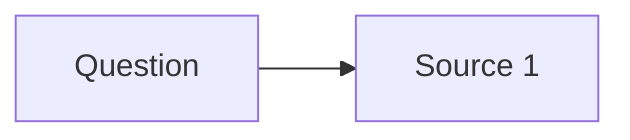

# ${title}

Research digest: a question answered from cited sources, with what they mean for this work.

<abstract>

<!-- FILL: two to four sentences. The question, the answer in one line, and how confident the evidence makes it. -->

</abstract>

<question>

## Question

<!-- FILL: the question, broken into the sub-questions this digest answers. State the scope: time range, geography, source types. -->

</question>

<findings>

## Findings

<!-- FILL: each finding with its citation as a resolvable URL. Mark anything unconfirmed as UNVERIFIED. Note where sources conflict. -->

## Applicability

| Source | Reuse, reject, or gap | Why |
|--------|-----------------------|-----|
| FILL: source | FILL: reuse, reject, or gap | FILL: reason for this topic |

## Refine

<!-- FILL: what to change in method, data, or scope because of these findings. -->

## Map

</findings>

<open_questions>

## Open questions

- FILL: one unknown per item, or "None."

</open_questions>

<references>

## References

<!-- FILL: every cited URL, one per line. ultragentic docs check-citations checks that each resolves. -->

</references>

<revisions>

## Revisions

Appended by `ultragentic docs revise <this file> "<what changed>"`. Do not edit dates by hand.

| Date | Change |
|------|--------|
| ${date} | Created. |

</revisions>
