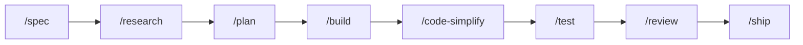
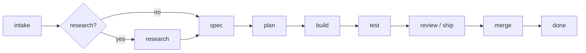
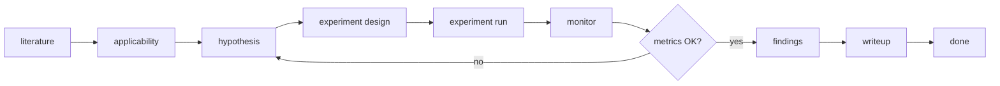

# Ultragentic: everything you need in the agentic era

**The spec-to-PR agent harness for Claude Code, Codex, Cursor, and opencode.**

Agent skills, slash commands, hooks, and a Go runtime that take an AI coding agent from a one-line
goal to a reviewed pull request, moving to the next step only on recorded evidence (tests, lint, CI,
review) that the last one passed.

- **One toolkit, every coding agent.** The same `/spec`, `/plan`, `/build`, `/test`, `/review`, and
  `/ship` commands, skills (`SKILL.md`), and hooks run in Claude Code, Codex CLI, Cursor, opencode,
  Google Antigravity, Kimi Code, and Muse.
- **Spec-driven, evidence-gated delivery.** `/goal` and `/auto` run a delivery graph
  (spec → plan → build → test → review → PR) where the runtime, not the model, decides what runs next.
- **Guardrails built in.** Permission policy, pre-tool gates, secret hygiene, and a shared
  `AGENTS.md` baseline, so vibe coding stays reviewable.

Install it once per machine, or mount it into any repo as a git submodule under `.ultragentic/`.
Domain rules live in each repo's own `AGENTS.md`.

**Contents:** [Quick start](#quick-start) · [The runtime](#the-runtime) · [Ways to work](#ways-to-work) ·
[Research and experiments](#research-and-experiments) · [Install options](#install-options) ·
[Supported coding hosts](#supported-coding-hosts) · [Add third-party skills](#add-third-party-skills) ·
[Watch a run](#watch-a-run) · [Upgrading from vibe-agent](#upgrading-from-vibe-agent) ·
[Contributing](#contributing)

## Quick start

You need `git`, `curl`, and `openssl` (the runtime installs itself on first use; see [The runtime](#the-runtime)). Some hooks call
`python3` (3.8+, stdlib); on Windows, disable the Microsoft Store `python3` alias or those hooks fail
silently.

**1. Install globally** (every project on this machine gets the commands; the `ultragentic` runtime follows on first use):

```bash
git clone https://github.com/ducnd58233/ultragentic.git
cd ultragentic
sh scripts/install-global.sh
# Windows: powershell -ExecutionPolicy Bypass -File scripts/install-global.ps1
```

Keep the clone: the installed skills and commands are links back to it, so `git pull` updates them.
On Git Bash they are copies instead; re-run the script after pulling.

**2. Open your coding agent in any repo and give it a goal:**

```text
/ua-goal Add host token counts to the Chat toolbar.
```

Codex CLI uses `$` instead of `/` (`$ua-goal`). Next: pick how much you want to steer in
[Ways to work](#ways-to-work).

## Ways to work

Three paths over the same assets. What changes is who drives each gate.

| Path | You type | Who moves to the next step | Use it when |
|---|---|---|---|
| Step by step | `/spec`, `/plan`, `/build`, … | You | You want to stop and review between stages |
| One outcome | `/goal <objective>` | The runtime, pausing at your approvals | You know the outcome and want checkpoints |
| Unattended | `/auto <objective>` | The runtime, gates closed by evidence | The work is routine and the repo has opted in |

Command names in this section are the workspace form. A global install adds the `ua-` prefix
(`/ua-goal`); see [How commands look in your host](#how-commands-look-in-your-host).



### Step by step

Run each command yourself. Skip `/research` when the repo already has the facts; `/code-simplify` is
optional. `/build` through `/ship` need the runtime.

| Command | Role |
|---|---|
| `/spec` | Write the spec. |
| `/research` | Citation-first digest (see [Research and experiments](#research-and-experiments)). |
| `/plan` | Tasks from an approved spec. |
| `/build` | One planned task on its own branch. Needs the runtime. Never merges to `main`. |
| `/test`, `/review`, `/ship` | Proof, review, merge gate. Need the runtime. |

`/design`, `/analyze`, and `/investigate` are optional when the work needs extra passes. Full list:
[`.ai-agents/commands/ROUTER.md`](.ai-agents/commands/ROUTER.md).

### One outcome (`/goal`)

The same pipeline, but the runtime graph walks the sequence and pauses at checkpoints. You approve
the spec and the plan.



```text
/goal Add host token counts to the Chat toolbar.
```

The host agent runs `ultragentic goal "<your text>"`. Slug and graph are derived; do not pass
`--goal`, `--graph`, or `--slug`. Rules: [`.ai-agents/commands/goal.md`](.ai-agents/commands/goal.md).

### Unattended (`/auto`)

Same graphs and checks as `/goal`, but approval gates close on evidence instead of waiting for you.
Requires the runtime and a workspace opt-in file.

```bash
ultragentic auto init                              # writes .agent-state/auto.yaml (merge: false)
ultragentic auto "Add webhook idempotency"         # goal-delivery
ultragentic auto research "Compare RAG chunking"   # researcher-delivery
```

| Gate | `/goal` | `/auto` |
|---|---|---|
| Spec and plan | You approve | Skipped when the docs pass structural checks |
| Merge to `main` | You approve | Only if `auto.yaml` says `merge: true` and CI, tests, lint, and `/ship` already pass |
| Danger list (migrations, prod writes, credentials, …) | You decide | Stops every time |

No opt-in file, or `merge: false`, means auto stops at a green PR and you merge manually. Rules:
[`.ai-agents/commands/auto.md`](.ai-agents/commands/auto.md).

### Work that is not code (`/task`, `/tutor`)

For a report, an analysis, a document, a data job, an ops step, or a message to other people, there
is no branch or pull request to gate on. `/task` runs the `task-delivery` graph instead: you approve
a spec with written acceptance rows, the work is checked row by row, and you approve the exact
delivery before anything is sent, posted, paid, or shared.

```text
/task Summarize the vendor renewal terms in the attached contract and draft a reply to the account manager
```

The host agent runs `ultragentic task "<your text>"`. `/auto task` reaches the work on its own and
stops at the delivery gate every time, because the delivery step is the one a person has to approve.
Rules: [`.ai-agents/commands/task.md`](.ai-agents/commands/task.md).

To study a subject yourself, `/tutor` (or `/goal tutor`) tests what you can do instead of telling you
what to know: it asks first, plans around your deadline, teaches by questions, and schedules reviews
on computed dates in a study record you own. The run remembers where you are between sessions and
ends only when every topic is tested as learned. Rules:
[`.ai-agents/commands/tutor.md`](.ai-agents/commands/tutor.md).

### How the runtime picks a graph

`/goal` and `/auto` pick the graph in one of two ways, and print which. Name the kind of work first
(`delivery`, `research`, `experiment`, `task`, or `tutor`) and that graph starts. Name nothing and the
runtime reads the objective with fixed rules, then prints the words that decided it on a `chosen`
line, so a wrong guess is visible and one command fixes it.

| You write | Graph | Notes |
|---|---|---|
| `/goal Add retry to the webhook dispatcher` | `goal-delivery` | Code words, or no routing words: the default |
| `/goal task Summarize the vendor contract` | `task-delivery` | A report, document, data job, ops step, or message |
| `/goal research Compare chunking strategies` | `researcher-delivery` | Literature, then experiment and findings |
| `/goal experiment Benchmark two embedding models` | `researcher-delivery` | The same graph, entered for an experiment |
| `/goal tutor Linear algebra for my exam` | `study-delivery` | A learner studying over many sessions. No `/auto` form |
| `/goal Implement the export endpoint and write a report on how it works` | `goal-delivery` | A code change and a non-code deliverable: the report is delivered after the last code task. `--with-task` forces this |

An objective that could be two kinds (research plus a document to write) is a question: the runtime
asks which, and does not guess. `/auto` acts on a guess only when the signal is strong, and otherwise
asks for the word. To force the default, write `delivery` first.

## Research and experiments

`/research`, `/experiment`, `/goal research`, `/goal experiment`, and the same words after `/auto` use
the `researcher-delivery` graph. An objective with code words uses goal-delivery instead; research
there is at most one phase before spec.



| Intent | Slash (global) | Host runs | Graph |
|---|---|---|---|
| Cited digest; you approve applicability and design | `/ua-research "<topic>"` | `ultragentic research "<topic>"` | `researcher-delivery` |
| Literature, experiment, metric loop (unattended) | `/ua-auto research "<topic>"` | `ultragentic auto research "<topic>"` | `researcher-delivery` |
| Research as one phase, then spec, build, and PR | `/ua-auto "<outcome>"` | `ultragentic auto "<outcome>"` | `goal-delivery` |

Examples:

```text
/ua-research Chunking strategies for RAG on legal PDFs

/ua-auto research Compare embedding models; loop until recall@10 >= 0.85

/ua-auto Add a small LLM inference module: research quantization, spec, implement, test, open PR
```

The third example starts **goal-delivery** (optional research node, then spec and ship). Only the
second runs the experiment monitor and `experiment/METRICS.json` loop that can route back to
hypothesis.

More: [`.ai-agents/commands/research.md`](.ai-agents/commands/research.md), graph
[`.ai-agents/graphs/researcher-delivery.yaml`](.ai-agents/graphs/researcher-delivery.yaml).

## Install options

There are two install shapes, and they're not alternatives — most setups end up using both:

| | Global | Workspace |
|---|---|---|
| What it is | One shared copy for the whole machine | A copy mounted inside one repo — think git submodule or vendored subfolder, not a system package |
| Where it lands | `~/.ultragentic`, `~/.claude/skills`, … | `.ai-agents/` inside whichever repo it's linked into |
| Commands | Prefixed: `/ua-goal`, `$ua-goal` | Unprefixed: `/goal`, `$goal` |
| Followed by | Every project on the machine | Only the repo it's linked into |
| Run it | Once per machine | Once per repo that should carry its own copy of the assets, permissions, and hooks — including this repo, if you're working on the toolkit itself |

| Goal | PowerShell | Bash |
|---|---|---|
| Global: put commands on PATH (`ua-goal`, `ultragentic`, …) | `powershell -ExecutionPolicy Bypass -File scripts/install-global.ps1` | `sh scripts/install-global.sh` |
| Workspace: link *this* checkout (`.claude`, `.cursor`, `.opencode`) | `powershell -ExecutionPolicy Bypass -File scripts/link-ai-agents.ps1` | `bash scripts/link-ai-agents.sh` |

The global install does not apply permissions or hooks to a project. Run the workspace link script
in a project to get those.

### Workspace install in another repo

To use ultragentic from a product repo without vendoring it, mount this toolkit as a git submodule at a
path of your choosing (`.ultragentic/` below), then run the *same* workspace link script from the row
above, pointed at the consumer repo instead of at itself:

```bash
git submodule add git@github.com:ducnd58233/ultragentic.git .ultragentic   # once, from the consumer repo root
bash .ultragentic/scripts/link-ai-agents.sh --workspace "$PWD" --assets "$PWD/.ultragentic/.ai-agents"
ultragentic doctor   # repeat until OK
```

`--workspace` is the consumer repo's root, where `.claude`, `.cursor`, and friends get written.
`--assets` always points at `<toolkit-root>/.ai-agents`, wherever the toolkit is mounted. The consumer
repo stays its own repository and the source of product code; ultragentic only supplies the shared
assets, the same way a submodule supplies shared library code without becoming part of your app.

### How commands look in your host

Claude Code, Cursor, and opencode use `/`. Codex CLI uses `$`. A global install adds the `ua-`
prefix; a workspace install does not.

| Tool | Global example | Workspace example |
|---|---|---|
| Claude Code, Cursor, opencode | `/ua-goal` | `/goal` |
| Codex CLI | `$ua-goal` (skill) | `$goal` |

Codex does not load custom `/prompts`; this kit installs commands as skills. Authoring and clone
steps: [`.ai-agents/AUTHORING.md`](.ai-agents/AUTHORING.md). Full command list:
[`.ai-agents/commands/ROUTER.md`](.ai-agents/commands/ROUTER.md).

## Supported coding hosts

The runtime hooks session start, prompt submit, pre-tool gates, post-tool journaling, and stop for
every host below. Delivery commands (`/goal`, `/build`, `/test`, `/ship`, `/auto`) need the
`ultragentic` binary on PATH; hook wiring alone is not enough.

| Host | Binary | Hook config | Status |
|---|---|---|---|
| Claude Code | `claude` | `.claude/settings.json` | Verified |
| Cursor | `cursor-agent` | `.cursor/hooks.json` | Verified |
| Codex CLI | `codex` | `.codex/config.toml` | Verified |
| opencode | `opencode` | `opencode.json` | Verified |
| Google Antigravity | `antigravity` | `.agents/hooks.json` (user: `~/.gemini/config/hooks.json`) | Hook wiring shipped; camelCase stdin mapped; UNVERIFIED until observed on a live host |
| Kimi Code | `kimi` | `.kimi-code/hooks.toml` (merge into `~/.kimi-code/config.toml`) | All six events wired from the vendor docs; hooks are user-level only; UNVERIFIED |
| Muse | `muse` | `.muse/hooks.json` | Six events wired; refusals also exit 2 because the host fails open otherwise; run `muse hooks trust` |

`bash scripts/link-ai-agents.sh` and `scripts/link-ai-agents.ps1` create Antigravity, Kimi Code, and
Muse hook stubs when those files are missing. `ultragentic doctor` scans all seven configs and reports
wiring status. Generated hook contracts:
[`.ai-agents/references/host-hook-contracts.md`](.ai-agents/references/host-hook-contracts.md).

Codex, Antigravity, Kimi Code, and Muse all read `.agents/skills/` (Agent Skills layout), so the
command skills synced there reach all four. Cursor and Claude keep commands under their own generated
views.

## Add third-party skills

Install a community Agent Skill into Claude Code, Codex, Cursor, and/or opencode. This is not the
same as editing this toolkit: do not copy third-party trees into `.ai-agents/`. `ultragentic` must be
on PATH (global install above) and `npx` must be available.

```bash
# All four hosts, user-level:
ultragentic skills add <owner/repo> -g -y

# One host, one skill from a multi-skill repo:
ultragentic skills add <owner/repo> -a cursor -g -y --skill <name>

# Same install without the wrapper:
npx skills add <owner/repo> -a claude-code -a codex -a cursor -a opencode -g -y
```

`-a` may be `claude-code`, `codex`, `cursor`, or `opencode`. Repeat `-a` for a subset. `-g` is
user-level; omit it to install into the current project.

Skills written for one host often carry extra frontmatter. Report it; files are not rewritten. This
command never writes MCP configs or host hooks.

```bash
ultragentic skills convert-report ~/.agents/skills/<name>
```

Where files land, the Codex `~/.codex/skills` trap, and host-only keys:
[Third-party Agent Skills in AUTHORING.md](.ai-agents/AUTHORING.md#third-party-agent-skills-not-this-toolkit).

## Watch a run

```bash
ultragentic run status --slug <slug>
ultragentic web --open    # http://127.0.0.1:1411/, local only
```

Runtime flags: `ultragentic --help`. The runtime is closed source; see [The runtime](#the-runtime).

## The runtime

Everything in this repository is open (MIT) and works as plain markdown. The control plane that
makes `/goal`, `/auto`, `/build`, `/test`, `/review`, and `/ship` enforceable is the `ultragentic`
runtime, a **closed-source binary** built in a private repository and published here as release
assets.

**You don't install it.** The first time your agent runs a delivery command and finds no runtime,
it asks you once to accept the runtime license, then downloads and installs it itself and carries on.
(`sh scripts/install-global.sh` also offers to install it when you run it in a terminal.)

- **The license is your call.** [`RUNTIME-LICENSE.md`](RUNTIME-LICENSE.md): free to use, including
  commercially, but no reverse engineering and no redistribution. The agent never accepts it for you,
  and it stops instead of installing when nobody is there to ask (CI, unattended runs).
- **Every download is verified.** The installer checks an ECDSA signature over `SHA256SUMS` against
  the key pinned in [`scripts/ultragentic-release.pub.pem`](scripts/ultragentic-release.pub.pem),
  then the binary's checksum. A missing or bad signature stops the install; nothing skips it.
- **Third-party components** in the binary and their licenses: [`THIRD_PARTY_NOTICES.md`](THIRD_PARTY_NOTICES.md).
- **Manual install,** if you prefer: `bash scripts/install-runtime.sh` (macOS, Linux, Git Bash) or
  `powershell -ExecutionPolicy Bypass -File scripts/install-runtime.ps1` (Windows). In CI, set
  `UA_ACCEPT_LICENSE=1`.
- **Without the runtime,** the delivery commands do not pretend to run; the markdown assets work as is.

## Upgrading from vibe-agent

This project was called `vibe-agent`. Commands, files, and variables now use `ultragentic` and the
`ua-` prefix:

| Before | Now |
|---|---|
| `vibe-agent` binary, `~/.vibe-agent` | `ultragentic`, `~/.ultragentic` |
| `/vibe-goal`, `$vibe-goal` (global install) | `/ua-goal`, `$ua-goal` |
| `vibe-checks.yaml`, `apiVersion: vibe-agent/v1` | `ua-checks.yaml`, `apiVersion: ultragentic/v1` |
| `VIBE_*` environment variables, `vibe_*` MCP tools | `UA_*`, `ua_*` |

**Global install.** Uninstall with the *old* checkout first, because its manifest is what lists the
`vibe-` entries to remove. Then install from the new one:

```bash
sh scripts/install-global.sh --uninstall   # in the old checkout, before pulling
rm -f ~/.local/bin/vibe-agent && rm -rf ~/.vibe-agent
git pull && sh scripts/install-global.sh
```

**Each consumer repo.** Rename the check plan, update `apiVersion` in its YAML files, and re-run the
link script so hooks call `ultragentic`. A submodule mounted at `.vibe-agent/` keeps working; the
runtime finds the toolkit in any directory one level down.

```bash
git mv vibe-checks.yaml ua-checks.yaml
grep -rl 'vibe-agent/v1' --include='*.yaml' . | xargs perl -pi -e 's{vibe-agent/v1}{ultragentic/v1}'
bash .vibe-agent/scripts/link-ai-agents.sh --workspace "$PWD" --assets "$PWD/.vibe-agent/.ai-agents"
ultragentic doctor
```

## Contributing

Edit sources under [`.ai-agents/`](.ai-agents) (new skills go in [`.ai-agents/skills/`](.ai-agents/skills))
and follow [AUTHORING.md](.ai-agents/AUTHORING.md).
Paths like `.claude/`, `.cursor/`, and `.codex/` are generated views; re-run the link script after
changes. To install someone else's skill, use [Add third-party skills](#add-third-party-skills), not
this folder.

**Who merges.** Only the repository owner merges, and only to `main` through a pull request. `main`
rejects direct pushes, force pushes, and deletion, and a pull request needs the `check` job green and
the owner as code owner (`.github/CODEOWNERS`). Outside contributions are welcome as pull requests
from a fork; the owner decides what lands. Agents working in this repo never merge or push to
`main` on their own: merging needs the owner's explicit say-so after `/ship` returns GO (see
"Merge approval" in [AGENTS.md](AGENTS.md)).
